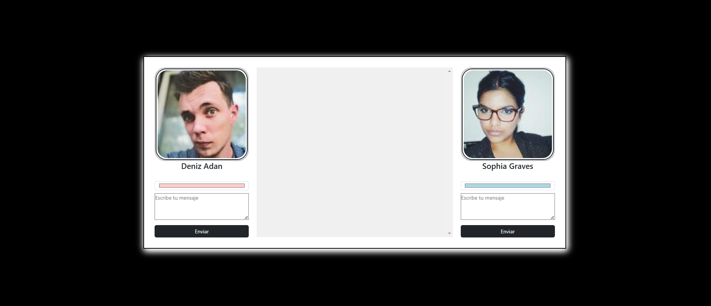

# **CONSUMING DATA FROM A REST API FOR A CHAT**

A mini application with a chat theme that enables dialogue between two users.

---

## **Technologies Used**
- **Vue.js**
- **JavaScript**
- **Bootstrap**
- **HTML5**
- **CSS3**

---

## **Features**
- **Data Consumption from a REST API**  
  - Fetches two random users when the application loads using the Random User API.

- **Dynamic Chat Interface**  
  - Simulates a conversation between two strangers, with the option to send personalized messages.

- **Real-Time Message Logging**  
  - Each user can send a new message to the chat, defining:
    - Text content.
    - A representative color for the message.

- **Reusable Chat Component**  
  - The chat area is handled by a child component that:
    - Displays all the messages sent.
    - Includes the name of the owner for each message.

- **Reactive Styles in the Chat**  
  - Uses `style` or `class binding` to:
    - Align messages based on the sender.
    - Change the background color of messages depending on their owner.

- **Component Lifecycle Management**  
  - User information is automatically retrieved when the application loads using the `onMounted` lifecycle hook or equivalent in Vue.js.

- **Event-Based Interactions**  
  - Users can add messages to the chat through events that dynamically update the interface.

- **Axios for Data Fetching**  
  - Makes HTTP requests to the Random User API with Axios, ensuring efficient data handling.

---

## **Screenshots**
<p align="center">
  
</p>

---

## **Installation**
1. Start the project:
   ```bash
   npm run dev


